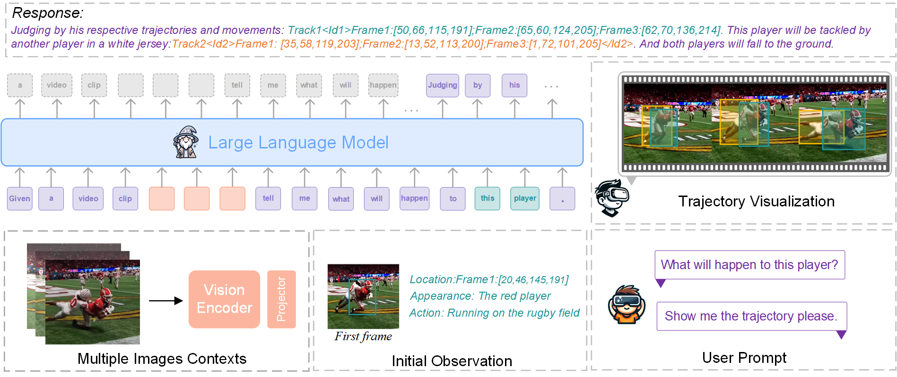

<p align="center">
  <a href="#">
</a>
  <h1 align="center"><font color="#966661">Merlin</font></h1>
</p>


<h3><a href="">Merlin: Empowering Multimodal LLMs with Foresight Minds</a></h3>

[En Yu](https://ahnsun.github.io/), [Liang Zhao](), [Yana Wei](), [Jinrong Yang](https://yancie-yjr.github.io/), [Dongming Wu](), [Lingyu Kong](), [Haoran Wei](https://scholar.google.com/citations?user=J4naK0MAAAAJ&hl=en), [Tiancai Wang](), [Zheng Ge](https://joker316701882.github.io/), [Xiangyu Zhang](https://scholar.google.com/citations?user=yuB-cfoAAAAJ&hl=en), and [Wenbing Tao]()
	
<a href="https://ahnsun.github.io/merlin/"></a>
<a href="https://arxiv.org/pdf/2312.00589.pdf"></a> 

Merlin is a groundbreaking model capable of generating natural language responses that are intricately linked with object trajectories of multiple images. Merlin excels in predicting and reasoning about future events based on initial observations, showcasing an unprecedented capability in future prediction and reasoning. Merlin achieves SOTA performance on the established Future Reasoning Benchmark and mulitiple existing MLLM benchmark (MMbench and MMVet), which shows powerful multi-modal general ability and forsight minds.




Code, model weights, and demo will be released soon.


## Contact
If you have any questions related to the code or the paper, feel free to email En Yu (`yuen@hust.edu.cn`).

## License
Our model and weights are licensed for both researchers and commercial entities, upholding the principles of openness. The license is drafted by modification of the license of [LLaMA](https://github.com/facebookresearch/llama).

See the [LICENSE](./LICENSE), as well as our accompanying [Acceptable Use Policy](./USE_POLICY.md).

## Citation

If you find our work useful in your research, please consider citing Merlin:
```tex
@article{yuen2023merlin,
  author = {Yu, En and Zhao, Liang and Wei, Yana and Yang, Jinrong and Wu, Dongming and Kong, Lingyu and Wei, Haoran and Wang, Tiancai and Ge, Zheng and Zhang, Xiangyu and Tao, Wenbing},
  title = {Merlin: Empowering Multimodal LLMs with Foresight Minds},
  journal = {arXiv preprint arXiv:2312.00589},
  year = {2023},
}
```
